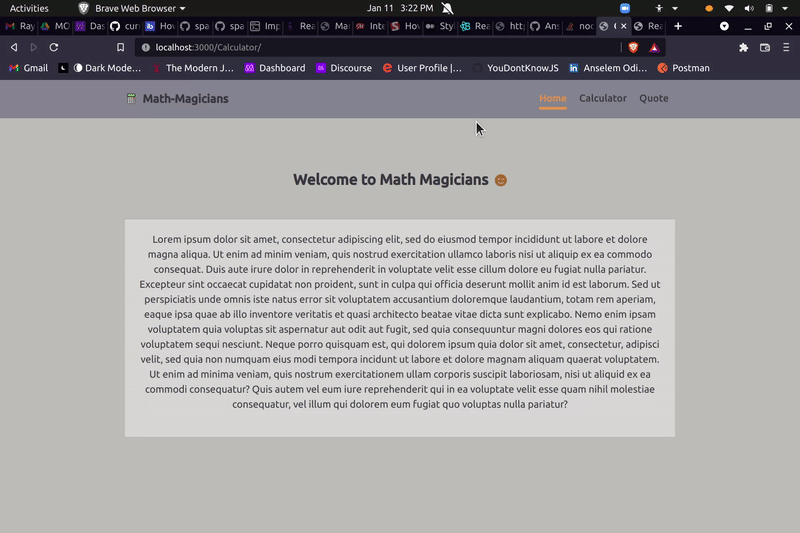

# Calculator

> Calculator is a single page application built to calculate simple mathematical operations. It is built using React and CSS.


## Mini Demo




Additional description about the project and its features.

## Built With

- Major languages (JavaScript)
- Framework/Libraries (React)
- Technologies/tools used 
  
  ``` bash
  - create-react-app tool
  - Webpack(Code Bundlng et al)
  - Babel (code transpiling)
  - Jest(for testing)
  - Git(version control)
  - ESLint(JavaScript linting)
  - Stylelint(style linting)

  ```

## Live Demo

[Website Link](https://anselemodims.github.io/Calculator/)

## Getting Started

To get a local copy up and running follow these simple example steps.

### Prerequisites
 - A text editor(preferably Visual Studio Code)
### Install
  -  [Git](https://git-scm.com/downloads)
  -  [Node](https://nodejs.org/en/download/)
### Usage
#### Clone this repository

```bash
$ git clone git@github.com:AnselemOdims/Calculator.git
$ cd Calculator
```
#### Run project

```bash
$ npm install
$ npm run start # this will make webpack watching for your changes in code
```

#### Open page in browser
```bash
$ open public/index.html
```

  <br>

## Authors

👤 **Anselem Odimegwu**

- GitHub: [github](https://github.com/AnselemOdims)
- LinkedIn: [LinkedIn](https://www.linkedin.com/in/anselem-odimegwu/)

<br>

## 🤝 Contributing

Contributions, issues, and feature requests are welcome!

Feel free to check the [issues page](https://github.com/AnselemOdims/Calculator/issues).

<br>

## Show your support

Give a ⭐️ if you like this project!

## 📝 License

This project is [MIT](https://opensource.org/licenses/MIT) licensed.
